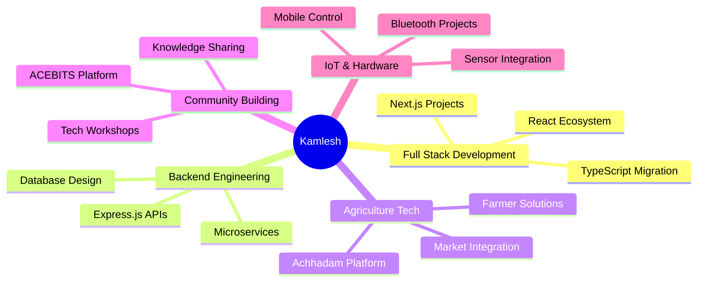

<div align="center">

#  Hey there! I'm Kamlesh Kumar Sharma

<div>
  
</div>

<br/>

<p align="center">
  <a href="https://www.linkedin.com/in/kamlesh-sharmathink">
    
  </a>
  <a href="https://github.com/kamleshthink">
    
  </a>
  
</p>


</div>

##  About Me

```typescript
const kamlesh = {
    location: "Dhanbad, Jharkhand, India 🇮🇳",
    role: "Full Stack Developer",
    education: "Civil Engineering Student & Computer Science Student",
    currentFocus: ["Building Scalable Web Applications", "Open Source"],
    organizations: ["@AIconsciousness", "@ACEBITSINDRI", "@Devcelerate"],
    
    techStack: {
        frontend: ["React.js", "Next.js", "TypeScript", "Vite"],
        backend: ["Node.js", "Express.js", "REST APIs"],
        languages: ["JavaScript", "TypeScript", "Python", "C"],
        database: ["MongoDB", "PostgreSQL"],
        tools: ["Git", "Docker", "VS Code"]
    },
    
    currentlyWorking: "Building innovative solutions at multiple organizations",
    openToCollaborate: true,
    
    motto: "Code. Build. Innovate. Repeat. 🚀"
};
```


##  Tech Stack & Skills

<div align="center">

### 💻 Programming Languages
<p>
  
  
  
  
  
  
</p>

### 🎨 Frontend Development
<p>
  
  
  
  
  
  
</p>

### ⚙️ Backend Development
<p>
  
  
  
  
</p>

### 🛠️ Tools & Technologies
<p>
  
  
  
  
  
</p>

</div>


## 🏆 Featured Projects

<div align="center">

<table>
<tr>
<td width="50%">

### 🌾 Achhadam - Agriculture Platform


A comprehensive **agriculture platform** that revolutionizes the farming ecosystem by connecting:
- 🚜 **Farmers** - Direct market access
- 🛒 **Buyers** - Fresh produce sourcing
- 🚚 **Transporters** - Logistics solutions

**Tech:** React.js, Next.js, TypeScript, Express.js, MongoDB

🔗 **[Visit Achhadam →](https://achhadam.com)**

</td>
<td width="50%">

### 🏗️ Ramsethu Construction


Modern construction company website with:
- 📱 Responsive design
- 🎨 Dynamic UI/UX
- 📊 Project showcase
- 💼 Service portfolio

**Tech:** TypeScript, React, Next.js, Tailwind CSS

🔗 **[Visit Site →](https://ramsethu1-construction.onrender.com/)**

</td>
</tr>

<tr>
<td width="50%">

### 👥 ACEBITS - Civil Engineers Community


Official platform for the **Association of Civil Engineers** community at BIT Sindri:
- 🎓 Student networking
- 📚 Knowledge sharing
- 🏆 Event management
- 💡 Resource hub

**Tech:** JavaScript, React, Node.js, Express

🔗 **[Visit ACEBITS →](https://acebits.in)**

</td>
<td width="50%">

### 🚗 Bluetooth Wireless Car


IoT-based wireless car project:
- 📡 Bluetooth connectivity
- 📱 Mobile app control
- ⚡ Real-time response
- 🎮 Interactive interface

**Tech:** Arduino, Bluetooth Module, Android, Kotlin

🔗 **[View Project →](https://github.com/kamleshthink/Bluetooth-wireless-car)**

</td>
</tr>

<tr>
<td width="50%">

### 💼 GIG Platform


Freelancer marketplace connecting:
- 👨‍💻 Freelancers
- 🏢 Clients
- 💰 Secure payments

**Tech:** TypeScript, Next.js, Node.js

</td>
<td width="50%">

### 🍽️ DesiDine Food Platform


Food delivery platform with:
- 🍕 Restaurant listings
- 🛵 Order tracking
- 💳 Payment integration

**Tech:** React, Express.js, MongoDB

</td>
</tr>
</table>

</div>


## 📊 GitHub Statistics

<div align="center">
  


</div>


## 🔥 2025 Contribution Highlights

<div align="center">

### 🎯 **781 Total Contributions in 2025**

<table>
<tr>
<td align="center" width="33%">

#### 🏢 Organizations

**@AIconsciousness**
<br/>
Agriculture & Innovation Platform
<br/>


**@ACEBITSINDRI**
<br/>
Civil Engineers Community
<br/>


**@Devcelerate**
<br/>
Development & Acceleration
<br/>


</td>
<td align="center" width="33%">

#### 📈 Top Repositories

**acchadam1** - 127 commits
<br/>
**Achhadam** - 74 commits
<br/>
**Ramsethu1-Construction** - 83 commits
<br/>
**Ramsethu-Construction** - 82 commits
<br/>
**Ramsetu_Constructions** - 82 commits
<br/>
**DesiDine-foods1** - 18 commits

</td>
<td align="center" width="33%">

#### 🚀 Key Projects

✅ **Achhadam Platform**
<br/>
Full-stack agriculture solution

✅ **Construction Websites**
<br/>
Multiple deployments

✅ **Community Platforms**
<br/>
ACEBITS & more

✅ **IoT Projects**
<br/>
Bluetooth car & more

</td>
</tr>
</table>

### 📊 Monthly Breakdown

```
Oct 2025 ████████████████████████░░░░░  300+ commits
Sep 2025 ████████████████░░░░░░░░░░░░  200+ commits  
Aug 2025 ███████████░░░░░░░░░░░░░░░░  150+ commits
Jul 2025 █████████░░░░░░░░░░░░░░░░░░  130+ commits
```

</div>


## 🎖️ GitHub Trophies

<div align="center">
  


</div>


## 🌐 Organizations & Contributions

<div align="center">

<table>
<tr>
<td align="center" width="50%">

### 🌾 AIconsciousness
**Agriculture Innovation Platform**

Leading development of **Achhadam** - revolutionizing agriculture through technology

- Full-stack development
- Platform architecture
- Feature implementation
- User experience design


</td>
<td align="center" width="50%">

### 🏗️ ACEBITSINDRI
**Association of Civil Engineers - BIT Sindri**

Building the official platform for civil engineering students

- Community management
- Website development
- Event coordination
- Resource management


</td>
</tr>
</table>

</div>


## 💼 Recent Activity

<!--START_SECTION:activity-->
- 🚀 Pushed major updates to **Achhadam** platform
- 🏗️ Launched **Ramsethu Construction** website
- 👥 Joined **ACEBITS** organization as Tech Lead
- 🌟 Contributed to **50+ repositories** across organizations
- ⚡ Deployed multiple production-ready applications
<!--END_SECTION:activity-->


## 🎯 Current Focus

<div align="center">



</div>


## 📫 Connect With Me

<div align="center">

<p>
  <a href="https://www.linkedin.com/in/kamlesh-sharmathink">
    
  </a>
  <a href="https://github.com/kamleshthink">
    
  </a>
  <a href="mailto:kamlesh@achhadam.com">
    
  </a>
</p>

### 💬 Open for:
- 🤝 Collaboration on innovative projects
- 💼 Freelance opportunities
- 🎯 Open source contributions
- 🚀 Building something awesome together

</div>


## ⚡ Fun Facts

<div align="center">

```javascript
const funFacts = {
    codeEditor: "VS Code with custom themes 🎨",
    favoriteStack: "MERN - Because JavaScript everywhere! 🚀",
    workingHours: "Late night coding sessions 🌙",
    firstProject: "Bluetooth Wireless Car 🚗",
    passion: "Solving real-world problems with code 💡",
    dream: "Building products that impact millions 🌍",
    motto: "Learn. Build. Share. Repeat. 🔄"
};

console.log("Let's build something amazing! 🚀");
```

</div>


<div align="center">

### 🌟 "Code is like humor. When you have to explain it, it's bad." 🌟


<p>
  
  
  
</p>

**⭐ Don't forget to star some repositories if you find them interesting!**


</div>


  
